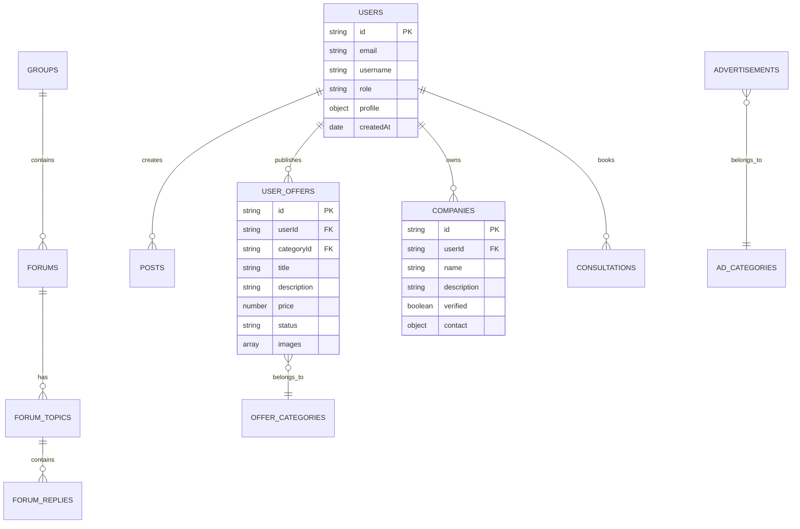
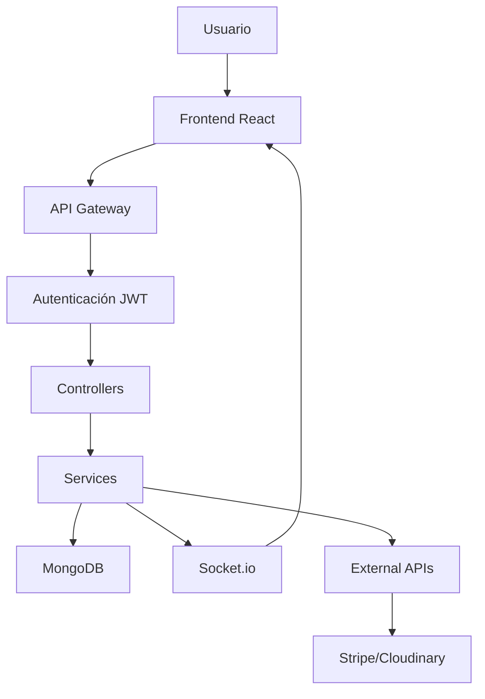

# Plan de Desarrollo - La Pública


**Duración estimada:** 27 semanas

**Stack principal:** React + Node.js + MongoDB\
**Metodología:** Desarrollo por fases con testing continuo


### Resumen Ejecutivo

#### Objetivo del Proyecto

Desarrollar una réplica completa de BuddyBoss en React con funcionalidades adicionales que mejoren la experiencia de usuario y amplíen las capacidades de la plataforma.

#### Funcionalidades Core

* ✅ Todas las características existentes de BuddyBoss
* 🆕 **Roll de Empresas**: Perfiles empresariales diferenciados
* 🆕 **Ofertas de Empresas**: Listado interno de servicios/productos
* 🆕 **Anuncios Categorizados de usuarios**: Sistema avanzado con tipos Oferta/Demanda
* 🆕 **Asesorías**: Plataforma de consultoría con videollamadas y pagos

#### Stack Tecnológico

| Componente     | Tecnología                         |
| -------------- | ---------------------------------- |
| Frontend       | React 18 + TypeScript              |
| Backend        | Node.js + Express + TypeScript     |
| Base de Datos  | MongoDB + Mongoose                 |
| Tiempo Real    | Socket.io                          |
| Autenticación  | JWT + bcrypt                       |
| Pagos          | Stripe                             |
| Storage        | Cloudinary/AWS S3                  |
| **Deployment** | **VPS Hostinger / Railway**        |
| CI/CD          | GitHub Actions                     |
| Reverse Proxy  | Nginx (VPS) / Railway (automático) |

***

### Análisis Funcional

#### Funcionalidades Heredadas de BuddyBoss

**👥 Gestión de Usuarios**

* Registro y autenticación
* Perfiles personalizables
* Sistema de roles y permisos
* Verificación de email

**🏘️ Comunidad**

* Grupos y comunidades
* Foros de discusión jerárquicos
* Feed de actividades
* Sistema de seguimiento

**💬 Comunicación**

* Mensajería privada y grupal
* Notificaciones en tiempo real
* Comentarios y reacciones
* Sistema de menciones

**📚 Contenido**

* Posts con rich media
* Eventos y calendario
* Sistema LMS básico
* Biblioteca de documentos

#### Nuevas Funcionalidades


**Roll de Empresas**

* Perfiles empresariales con verificación
* Directorio empresarial con filtros
* Sistema de certificación
* Analytics empresariales



**Ofertas de Usuarios**

* Marketplace interno de servicios/productos
* Categorización avanzada
* Sistema de reviews y ratings
* Contacto directo entre usuarios



**Anuncios Categorizados**

* Categorías personalizables
* Tipos: Oferta/Demanda
* Sistema de targeting
* Analytics de rendimiento





**Sistema de Asesorías**

* Booking de sesiones
* Videollamadas integradas
* Sistema de pagos
* Gestión de disponibilidad


***

### Arquitectura del Sistema

#### Esquema de Base de Datos



#### Flujo de Datos Principal



***

**Colecciones principales:**

* `users` - Información de usuarios
* `companies` - Perfiles de empresas
* `groups` - Grupos y comunidades
* `forums` - Foros de discusión
* `forum_topics` - Topics/hilos de foros
* `forum_replies` - Respuestas en foros
* `posts` - Publicaciones del feed
* `messages` - Mensajes privados
* `events` - Eventos
* `courses` - Cursos y contenido educativo
* `advertisements` - Anuncios promocionales (banners)
* `ad_categories` - Categorías de anuncios
* `user_offers` - Ofertas creadas por usuarios
* `offer_categories` - Categorías de ofertas
* `consultations` - Sesiones de asesoría
* `notifications` - Sistema de notificaciones
* `reviews` - Reviews y ratings

### 4. Fases de Desarrollo

#### FASE 1: Configuración y Fundamentos (Semanas 1-2)

**Backend Setup**

1. **Configuración inicial del proyecto**
   * Inicializar proyecto Node.js + TypeScript
   * Configurar Express server
   * Setup de MongoDB connection
   * Configurar variables de entorno
   * Setup de ESLint, Prettier
2. **Autenticación básica**
   * Modelos de User
   * Endpoints de registro/login
   * Middleware de autenticación JWT
   * Validación de datos con Joi/Yup
3. **Estructura base de API**
   * Router principal
   * Middleware de errores
   * Logging básico
   * CORS configuration

**Frontend Setup**

1. **Configuración del proyecto React**
   * Create React App / Vite setup
   * TypeScript configuration
   * Setup de routing básico
   * Configuración de estado global
2. **UI Foundation**
   * Sistema de design tokens
   * Componentes base (Button, Input, Modal, etc.)
   * Layout principal
   * Responsive design setup

#### FASE 2: Autenticación y Perfiles (Semanas 3-4)

**Backend**

* Endpoints completos de autenticación
* Reset de contraseña por email
* Verificación de email
* CRUD de perfiles de usuario
* Upload de avatares e imágenes

**Frontend**

* Páginas de login/registro
* Formularios de perfil
* Upload de imágenes
* Validación en tiempo real
* Manejo de estados de carga

**Testing**

* Tests unitarios para autenticación
* Tests de integración API

#### FASE 3: Sistema de Posts y Feed (Semanas 5-6)

**Backend**

* Modelo de posts con rich content
* Sistema de likes y comentarios
* Feed algoritmo básico
* Paginación y filtros

**Frontend**

* Componente de creación de posts
* Feed infinito con scroll
* Sistema de likes/comentarios
* Editor rich text básico

#### FASE 4: Grupos y Foros (Semanas 7-9)

**Backend**

* CRUD de grupos
* Sistema de membresías
* **Sistema de Foros completo**:
  * Modelos: Forums, Topics, Replies
  * Jerarquía de foros por grupo
  * Moderación y permisos
  * Sistema de etiquetas/tags
  * Búsqueda en foros
* Permisos por grupo

**Frontend**

* Páginas de grupos
* **Interfaz de foros**:
  * Lista de foros
  * Vista de topics/hilos
  * Editor para replies
  * Sistema de búsqueda
  * Moderación UI
* Gestión de membresías
* Feed específico por grupo
* Panel de moderación

#### FASE 5: Mensajería (Semanas 10-11)

**Backend**

* Sistema de chat en tiempo real (Socket.io)
* Mensajes privados y grupales
* Historial de conversaciones
* Estados de lectura

**Frontend**

* Interfaz de chat
* Lista de conversaciones
* Notificaciones en tiempo real
* Estados de conexión

#### FASE 6: Sistema de Eventos (Semanas 12-13)

**Backend**

* CRUD de eventos
* Sistema de RSVP
* Recordatorios automáticos

**Frontend**

* Calendario de eventos
* Páginas de detalle de evento
* Formularios de creación/edición

#### FASE 7: Funcionalidades Nuevas - Roll de Empresas (Semanas 14-15)

**Backend**

* Modelo extendido para empresas
* Verificación empresarial
* API de directorio de empresas
* Sistema de reviews/ratings

**Frontend**

* Perfiles empresariales
* Directorio con filtros
* Proceso de verificación
* Dashboard empresarial

#### FASE 8: Sistema de Ofertas de Usuarios (Semanas 16-17)

**Backend**

* **Modelo de ofertas de usuarios**:
  * CRUD completo de ofertas
  * Categorías de ofertas
  * Sistema de búsqueda y filtros
  * Moderación de contenido
  * Estados: activa/pausada/cerrada
* **Sistema de contacto**:
  * Mensajes directos por oferta
  * Tracking de interacciones
* **Reviews y ratings de ofertas**

**Frontend**

* **Páginas de ofertas**:
  * Formulario de creación de ofertas
  * Listado con filtros avanzados
  * Vista detalle de oferta
  * Sistema de contacto
* **Dashboard de ofertas del usuario**:
  * Mis ofertas publicadas
  * Ofertas favoritas
  * Mensajes recibidos
* **Sistema de búsqueda avanzada**

#### FASE 9: Sistema de Anuncios Categorizados (Semanas 18-19)

**Backend**

* **Gestión de anuncios promocionales**:
  * Categorías de anuncios
  * Tipos: Oferta/Demanda
  * Sistema de targeting básico
  * Analytics de visualizaciones
  * Moderación de contenido
* **API de categorías**:
  * CRUD de categorías
  * Jerarquía de categorías
  * Filtros dinámicos

**Frontend**

* **Panel de creación de anuncios**:
  * Selector de categoría y tipo
  * Preview en tiempo real
  * Configuración de targeting
* **Visualización categorizada**:
  * Filtros por categoría
  * Separación oferta/demanda
  * Búsqueda específica
* **Dashboard de analytics**
* **Gestión de campañas**

#### FASE 10: Sistema de Asesorías (Semanas 20-22)

**Backend**

* Booking system
* Integración con calendario
* Sistema de pagos (Stripe/PayPal)
* Gestión de disponibilidad

**Frontend**

* Calendario de disponibilidad
* Booking flow completo
* Integración con videollamadas
* Dashboard de asesorías

#### FASE 11: Notificaciones y Features Avanzadas (Semanas 23-24)

**Backend**

* Sistema completo de notificaciones
* Email notifications
* Push notifications setup
* Optimizaciones de performance

**Frontend**

* Centro de notificaciones
* Preferencias de usuario
* PWA features básicas

#### FASE 12: Testing y Optimización (Semanas 25-26)

**Testing completo**

* Tests E2E con Cypress/Playwright
* Tests de carga
* Security testing
* Performance optimization

**DevOps**

* CI/CD pipelines
* Monitoring setup
* Error tracking (Sentry)
* Analytics (Google Analytics)

#### FASE 13: Deploy y Launch (Semana 27)

**Opción 1: VPS Hostinger**

* **Configuración del servidor**:
  * Ubuntu 22.04 LTS setup
  * Node.js y MongoDB installation
  * Nginx como reverse proxy
  * SSL certificates (Let's Encrypt)
  * PM2 para process management
*   **Estructura de deployment**:

    ```
    /var/www/buddyboss/
    ├── frontend/ (build de React)
    ├── backend/ (API Node.js)
    ├── uploads/ (archivos estáticos)
    └── logs/
    ```
* **Configuración Nginx**:
  * Proxy para API en /api/\*
  * Servir archivos estáticos de React
  * WebSocket proxy para Socket.io
  * Rate limiting y security headers

**Opción 2: Railway**

* **Deploy automático**:
  * Conexión directa con GitHub
  * Auto-deploy en push a main
  * Variables de entorno configuradas
  * Scaling automático
* **Servicios Railway**:
  * Frontend: Static site deployment
  * Backend: Node.js service
  * Database: MongoDB service
  * Redis: Para caching (opcional)

**Database Options**

* **MongoDB Atlas** (recomendado para ambas opciones)
* **MongoDB en VPS** (solo para Hostinger)
* **Railway MongoDB** (integrado)

**CI/CD Pipeline**

* **GitHub Actions workflow**:
  * Tests automáticos
  * Build y deploy
  * Rollback automático en caso de error
  * Notificaciones de deploy

**Monitoreo y Mantenimiento**

* **Logging**: Winston + archivos rotatorios
* **Monitoring**: PM2 monit / Railway dashboard
* **Backups**: Automated MongoDB backups
* **SSL**: Auto-renewal configurado
* **Updates**: Rolling deployment strategy

### Consideraciones de Deployment

#### Comparación VPS vs Railway

| Aspecto           | VPS Hostinger              | Railway            |
| ----------------- | -------------------------- | ------------------ |
| **Control**       | Control total del servidor | Plataforma managed |
| **Configuración** | Manual (Nginx, PM2, etc.)  | Automática         |
| **Escalabilidad** | Manual scaling             | Auto-scaling       |
| **Costo**         | Fijo mensual (\~$10-50)    | Pay-per-use        |
| **Mantenimiento** | Requiere DevOps knowledge  | Minimal            |
| **SSL**           | Let's Encrypt manual       | Automático         |
| **CI/CD**         | Setup manual               | Integrado          |
| **Base de datos** | MongoDB local o Atlas      | Atlas o Railway DB |

#### Recomendación por Fase del Proyecto

\{% hint style="info" %\} **Para desarrollo y MVP**: Railway (setup rápido, menos complejidad) **Para producción estable**: VPS Hostinger (más control, costos predecibles) \{% endhint %\}

#### Configuración de Entornos

**Variables de Entorno Requeridas**

```bash
# Backend
NODE_ENV=production
PORT=3001
MONGODB_URI=mongodb://...
JWT_SECRET=your-secret-key
CLOUDINARY_URL=cloudinary://...
STRIPE_SECRET_KEY=sk_live_...
STRIPE_WEBHOOK_SECRET=whsec_...
SOCKET_CORS_ORIGIN=https://yourdomain.com

# Frontend (build time)
REACT_APP_API_URL=https://api.yourdomain.com
REACT_APP_STRIPE_PUBLIC_KEY=pk_live_...
REACT_APP_SOCKET_URL=https://api.yourdomain.com
```

**Nginx Configuration (VPS)**

```nginx
server {
    listen 80;
    server_name yourdomain.com;
    return 301 https://$server_name$request_uri;
}

server {
    listen 443 ssl;
    server_name yourdomain.com;
    
    ssl_certificate /etc/letsencrypt/live/yourdomain.com/fullchain.pem;
    ssl_certificate_key /etc/letsencrypt/live/yourdomain.com/privkey.pem;
    
    # Frontend
    location / {
        root /var/www/buddyboss/frontend;
        try_files $uri $uri/ /index.html;
    }
    
    # API
    location /api/ {
        proxy_pass http://localhost:3001;
        proxy_http_version 1.1;
        proxy_set_header Upgrade $http_upgrade;
        proxy_set_header Connection 'upgrade';
        proxy_set_header Host $host;
        proxy_cache_bypass $http_upgrade;
    }
    
    # Socket.io
    location /socket.io/ {
        proxy_pass http://localhost:3001;
        proxy_http_version 1.1;
        proxy_set_header Upgrade $http_upgrade;
        proxy_set_header Connection "upgrade";
    }
}
```

### Consideraciones Técnicas

#### Seguridad

* Autenticación JWT con refresh tokens
* Rate limiting en APIs
* Sanitización de inputs
* HTTPS obligatorio
* Validación de permisos por endpoint

#### Performance

* Lazy loading de componentes
* Optimización de imágenes
* Caching estratégico (Redis)
* Database indexing
* CDN para assets estáticos

#### Escalabilidad

* Arquitectura modular
* Microservicios preparation
* Database sharding considerations
* Load balancing preparation

### Estructura del Proyecto

#### Backend

```
src/
├── controllers/
├── models/
├── routes/
├── middleware/
├── services/
├── utils/
├── config/
└── tests/
```

#### Frontend

```
src/
├── components/
│   ├── common/
│   ├── forms/
│   └── layouts/
├── pages/
├── hooks/
├── services/
├── store/
├── utils/
├── types/
└── assets/
```

### Criterios de Éxito

#### Funcionales

* Todas las funcionalidades de BuddyBoss implementadas
* Nuevas funcionalidades funcionando correctamente
* Performance aceptable (<3s carga inicial)
* Responsive en todos los dispositivos

#### Técnicos

* Cobertura de tests >80%
* Zero errores críticos en producción
* Uptime >99.5%
* Escalable a 10k usuarios concurrentes

### Gestión de Riesgos

#### Riesgos técnicos

* **Complejidad del tiempo real**: Empezar con polling, evolucionar a WebSockets
* **Performance con gran volumen**: Implementar paginación y caching desde el inicio
* **Integraciones de terceros**: Tener alternatives ready para pagos y video

#### Riesgos de proyecto

* **Scope creep**: Documentar claramente cada feature antes de implementar
* **Timeline delays**: Buffer de 20% en estimaciones
* **Resource availability**: Plan de backup para skills críticos

### Próximos Pasos

1. **Setup del repositorio**: Crear estructura inicial de carpetas
2. **Environment setup**: Docker containers para desarrollo
3. **Database design**: Esquemas detallados de MongoDB
4. **API documentation**: Swagger/OpenAPI specs
5. **Component library**: Storybook setup para UI components

***

**Nota**: Este plan es iterativo y debe ajustarse según el progreso y feedback del proyecto. Se recomienda revisiones semanales para ajustes de timeline y prioridades.
